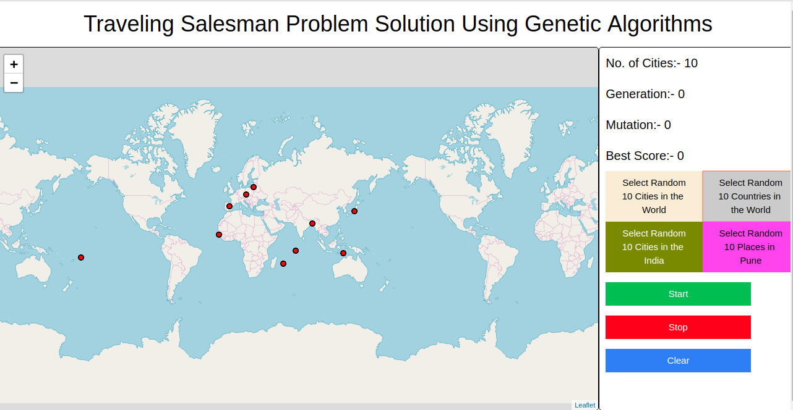

<h1><u>Traveling Salesman Problem Solution Using Genetic Algorithm</u></h1>

  &nbsp;&nbsp;&nbsp;&nbsp;This is a Javascript implementation of the Traveling Salesman Problem Solution Generation using a <b>Genetic Algorithm</b>. In this project the user can create a map of all the points he/she has to visit and then start the algorithm. The algorithm will find the shortest path for you to travel to all the mapped points and then return to the starting position with the minimum distance needed to be covered.

  

  &nbsp;&nbsp;&nbsp;&nbsp;You can even test the system by using the pre-defined datasets in which the system can randomly select any  10 cities from the world 10 countries 10 cities in India 10 Places in Pune.

<h2>Screen Shots</h2>
<h4>Plotted Points<h4>
  
<h4>Best Selected Path<h4>
  
